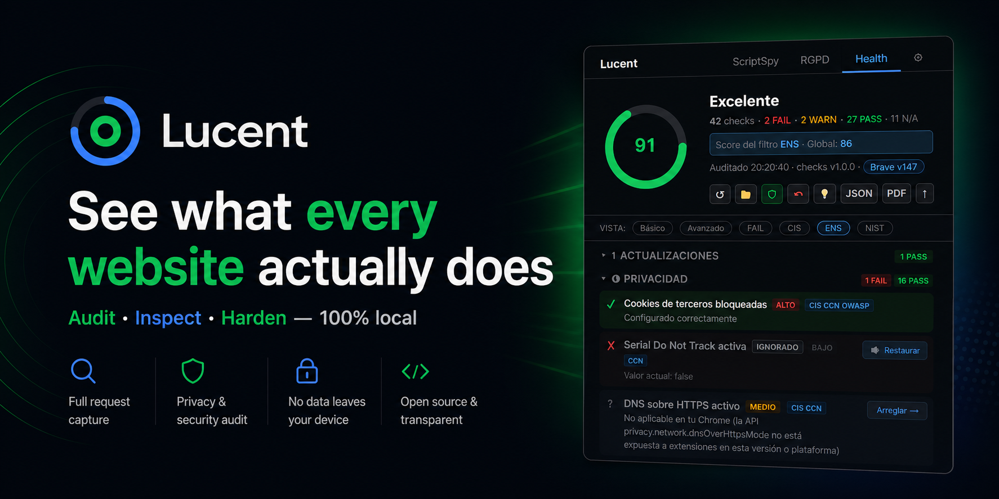
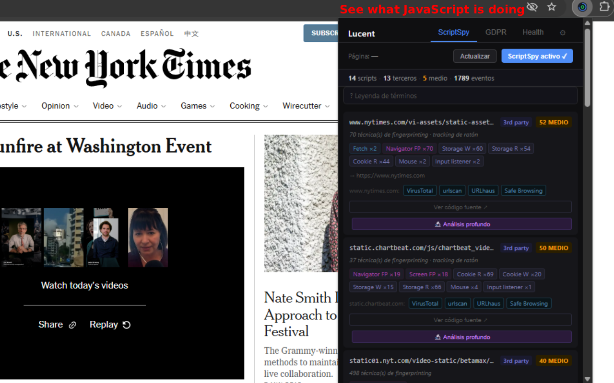
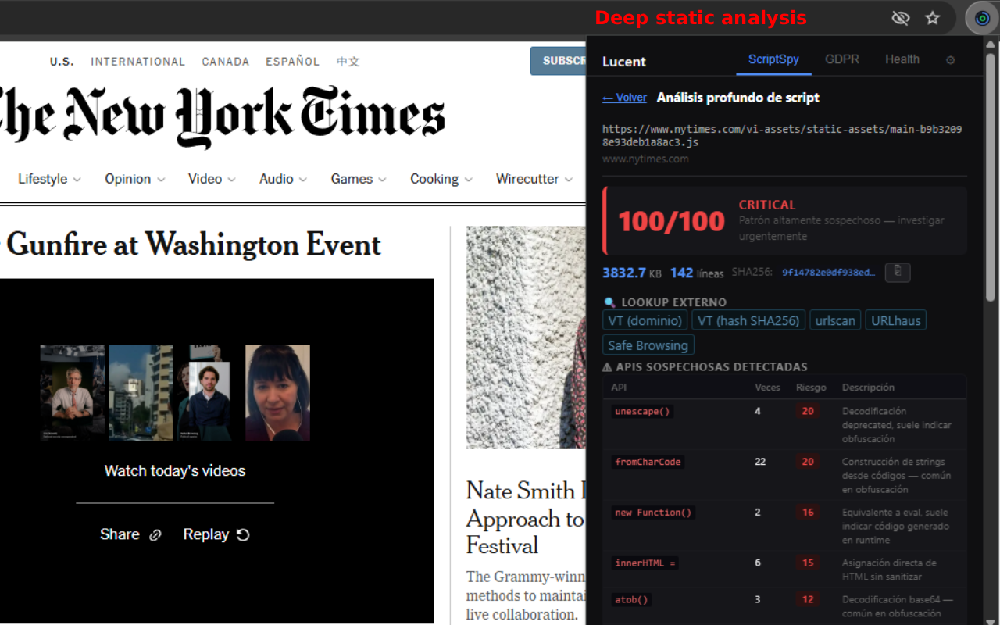
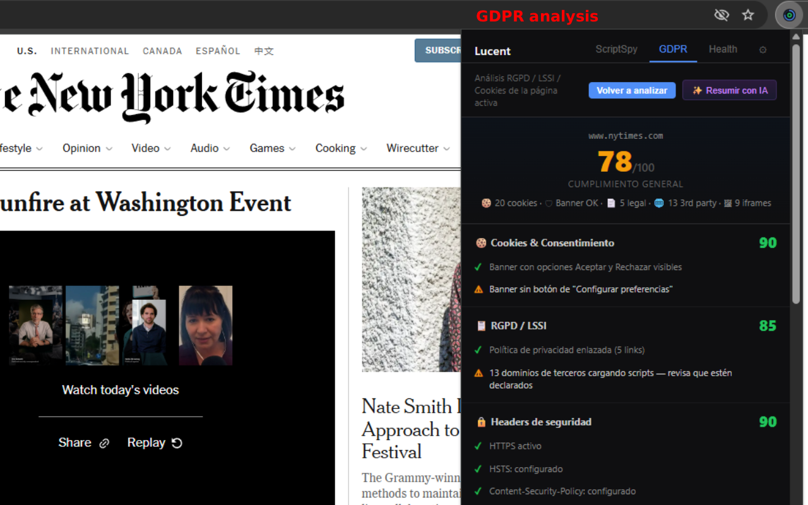
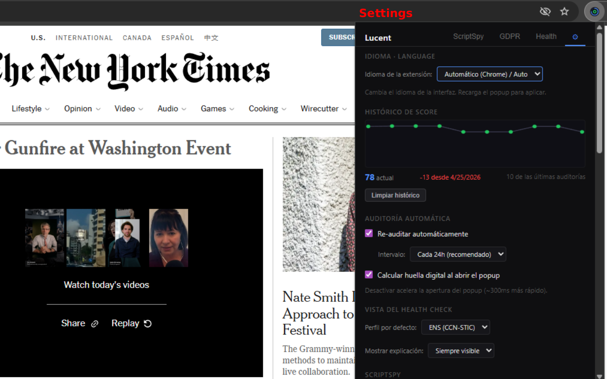

<div align="center">



# Lucent — Browser Audit

**The privacy &amp; security audit toolkit your browser was missing.**
Inspect every script in real time, audit GDPR &amp; cookie compliance, and harden 40+ settings against CIS, NIST and CCN-STIC — without an account, a server, or a single byte of telemetry.

[](LICENSE)
[](#)
[](docs/STATUS.md)
[](#)
[](#privacy)
[](#install)

[**Install**](#install) · [**Why Lucent**](#why-lucent) · [**Features**](#features) · [**Compare**](#how-it-compares) · [**Privacy**](#privacy) · [**Roadmap**](#roadmap)

</div>

---

## Why Lucent?

> Every website on the open web runs JavaScript you didn't write. Some of it tracks you. Some of it fingerprints you. Some of it siphons cookies and form values to third-party servers. Your browser shows none of this — until you ask the right questions.

**Lucent asks them.**

It's a Chrome MV3 extension that does three things at once, all on your device:

<table>
<tr>
<td width="33%" align="center">

### 🔬

**Inspect**

X-ray every script: network calls, cookie reads, fingerprint signals, input tracking. Per-script risk score, deep static analysis (SHA256 + 40+ suspicious-API patterns), runtime behavior tracking.

</td>
<td width="33%" align="center">

### 🛡

**Harden**

40+ checks against CIS Benchmark, NIST SP 800-53 and CCN-STIC-885 (Spanish ENS). One-click Apply per check. Persistent hardening with auto-restore — Lucent re-applies your settings every 30 min in case anything tampers with them.

</td>
<td width="33%" align="center">

### 📋

**Comply**

GDPR / cookie compliance audit per page: consent banners, cookie classification (analytics / advertising / functional / sensitive), CMP detection, TCF v2 consumer, cookie-wall heuristic, security headers, CSP, mixed content.

</td>
</tr>
</table>

---

## How it compares

| | **Lucent** | Lighthouse | Wappalyzer | PrivacyBadger | uBlock Origin |
|---|:---:|:---:|:---:|:---:|:---:|
| Real-time script inspection | ✅ | — | — | — | ✅ |
| Per-script SHA256 + obfuscation | ✅ | — | — | — | — |
| Runtime fallback when source blocked | ✅ | — | — | — | — |
| Browser-wide hardening (40+ checks) | ✅ | — | — | — | — |
| GDPR / cookie compliance audit | ✅ | — | — | partial | — |
| TCF v2 consent transparency | ✅ | — | — | — | — |
| CIS / NIST / CCN-STIC mapping | ✅ | — | — | — | — |
| Bilingual (EN / ES) | ✅ | partial | partial | — | partial |
| 100% local, zero telemetry | ✅ | ✅ | — | ✅ | ✅ |
| Free &amp; open source (MIT) | ✅ | ✅ | partial | ✅ | ✅ |

Lucent doesn't replace your blocker — it complements it. uBlock blocks; Lucent **explains, audits and hardens**.

---

## Features

### 🔬 ScriptSpy — see what scripts actually do

<details open>
<summary><b>Real-time monitoring</b> — every fetch, XHR, WebSocket, beacon, cookie read, storage write</summary>

- Aggregated by script URL with risk-tier badges (1P / 3P / first-party tracking).
- Live event timeline per script.
- "Reset events" without re-scanning the page.

</details>

<details>
<summary><b>Deep static analysis</b> — SHA256, obfuscation, suspicious APIs</summary>

- 40+ suspicious-API patterns: `eval`, `new Function`, `setTimeout(string)`, `document.write`, `innerHTML =`, `atob`, `unescape`, `RTCPeerConnection`, `clipboard`, `geolocation`, `crypto.subtle`, cryptominer signatures, `sendBeacon`…
- Obfuscation scoring: ratio of escapes, hex literals, single-char identifiers, comma-chained statements, eval edge cases (`window['eval']`, `[].constructor.constructor`).
- Network endpoints extraction — pulls hardcoded URLs adjacent to `fetch`/`XHR`/`sendBeacon` calls.
- DOM-injection patterns — `createElement('script'/'iframe')`, dynamic `<head>` mutations.
- Exfiltration heuristic — flags `cookie/storage read + ≥2 distinct sends` (informational, doesn't affect score).

</details>

<details>
<summary><b>Hash history &amp; supply-chain awareness</b></summary>

- Per-URL hash history (last 5 versions). When a script changes, Lucent flags it.
- Curated known-hashes DB stub (`extension/data/known-hashes.json`) — match → "this is GTM 4.2 official". Mismatch → audit manually.

</details>

<details>
<summary><b>Source-map detection</b></summary>

- Detects `//# sourceMappingURL=` directives and offers a one-click link to the original code.
- Useful on jQuery, React, Vue official builds and SaaS bundles that forget to disable maps in production.

</details>

<details>
<summary><b>Runtime fallback</b> — when the source is blocked</summary>

- CDN denied? CORS blocked? Returns 4xx? Lucent falls back to Performance Resource Timing + SRI status + observed runtime behavior — you still get a verdict.

</details>

### 🛡 Health Check — harden the browser, not the website

- **40+ checks** mapped to CIS Benchmark, NIST SP 800-53, CCN-STIC-885 (Spanish ENS).
- **One-click Apply** per check (auto-requests the necessary permission via `optional_permissions`).
- **Three profiles**: Básico (5 essentials), Estándar (CIS), NIST (full).
- **Per-check Undo** with a curated `breaking-settings.json` for sites that need a relaxed setting.
- **Diagnose mode** — "this site doesn't work?" → suggests which hardening to relax.
- **Master toggle** — turn the whole hardening ON/OFF without losing your applied state.
- **Persistent re-apply** every 30 min via `chrome.alarms` — doubles up Chrome's own setting persistence.
- **Multi-browser tips** — Brave gets Shields-aware advice, Edge gets Tracking Prevention pointers, Vivaldi/Opera get their own paths.
- **Mute checks** that don't apply to your threat model — they stop affecting your score.
- **Score history** — line chart with last/best/worst markers and delta.

### 📋 GDPR Compliance — pages, not browsers

- Cookie classification by purpose: analytics / advertising / functional / sensitive.
- **CMP detection** — TrustArc, OneTrust, Cookiebot, Quantcast, Sourcepoint, and 20+ more.
- **TCF v2 consumer** — calls `__tcfapi('getTCData', 2, …)` with a 2.5s poll for CMPs that register asynchronously. Reports CMP ID, accepted purposes &amp; vendors, legitimate-interest counts.
- **Cookie-wall detector** — multi-signal regex (price/period, "ad-free", "pay or accept", subscribe + currency). Requires ≥2 hits to flag.
- **Vendor list links** extracted from CMP banners.
- **Reset consent** without the `cookies` permission — clears `document.cookie` + storage + reload.
- **Sync vendor detection** — id/cookie syncing between trackers.
- **Sensitive data flag** — purpose-classified sensitive cookies highlighted.
- **JSON export** of the full report.

### 🤖 AI summary (optional, your key)

- Bring your own API key — Claude (Anthropic), OpenAI, or Ollama (localhost).
- Summarises privacy policies, security findings, audit reports.
- Content goes **directly** from your browser to your chosen provider. Lucent never proxies it.

---

## Screenshots

<table>
<tr>
<td></td>
<td></td>
</tr>
<tr>
<td align="center"><sub><b>ScriptSpy</b> — risk-scored scripts, live events</sub></td>
<td align="center"><sub><b>Deep analysis</b> — SHA256, obfuscation, suspicious APIs</sub></td>
</tr>
<tr>
<td></td>
<td></td>
</tr>
<tr>
<td align="center"><sub><b>GDPR audit</b> — cookies, headers, banners, libraries</sub></td>
<td align="center"><sub><b>Settings</b> — score history, profile, AI key</sub></td>
</tr>
</table>

---

## Install

### From Chrome Web Store

> ⏳ **Pending Google review.** The link will land here once approved. The latest release is also published as a `.zip` you can side-load.

### Manual (developer mode)

```bash
git clone https://github.com/wilasky/browser-audit.git
cd browser-audit
npm install
npm run build
```

In `chrome://extensions/`:

1. Enable **Developer mode** (top right toggle).
2. Click **Load unpacked**.
3. Select the `extension/dist/` folder.

Same flow on `brave://extensions/`, `edge://extensions/`, `opera://extensions/`, `vivaldi://extensions/`.

---

## Permissions — and why each is needed

| Permission | Required? | Why |
|---|:---:|---|
| `storage` | required | Persist your audit history, applied fixes, settings, and AI key (locally only). |
| `activeTab` | required | Run analysis on the page you're looking at — only on click. |
| `scripting` | required | Inject the compliance probe and runtime collector into the active tab. |
| `webNavigation` | required | Detect navigation events for live ScriptSpy session boundaries. |
| `alarms` | required | Re-apply the persistent hardening every 30 min. |
| `management` | optional | List installed extensions for the *Privacy / Extensions inventory* check. **Only requested when you enable that check.** |
| `privacy` | optional | Toggle browser-level settings (Do Not Track, network prediction, password autofill…). **Only requested when you Apply a setting that needs it.** |
| `contentSettings` | optional | Tweak per-site content settings (cookies, JavaScript, microphone…) for hardening. **Only requested when needed.** |
| `<all_urls>` | optional | Used by some advanced checks (CSP/header inspection). **Only requested when explicitly enabled.** |

**No `cookies` permission**, no `tabs` permission, no `webRequest` permission. Anything sensitive is `optional_permissions` and prompts at the moment of use, not at install.

---

## Privacy

> **Zero bytes leave your device by default.** No telemetry, no analytics, no accounts, no servers.

| | What Lucent does |
|---|---|
| URLs / browsing history | Never transmitted. |
| Cookies / storage / form values | Read locally for analysis only. Never transmitted. |
| Page content | Stays in your browser. |
| Audit results | Stored in `chrome.storage.local`. Yours. |
| AI key | Stored locally. Used to talk **directly** to Claude / OpenAI / Ollama — Lucent never proxies. |
| Pro tier (future) | Will send only normalised hashes (e.g. `SHA256(domain)`) for the optional features that need them. Never URLs. |

Full text in [docs/PRIVACY_POLICY.md](docs/PRIVACY_POLICY.md).

---

## Roadmap

The extension client (this repo) is **MIT** and stays free forever.

A future **Lucent Pro** (€2/mo personal · €10/mo pentester · €50/mo enterprise) will add:

- 🤖 Bundled AI proxy — no key needed.
- 🔒 Persistent per-setting locks with auto-restore on tampering.
- ⏪ Per-check undo with hardened state diff.
- 📊 90-day audit history retention.
- 📑 Professional PDF / CSV export.
- 🏢 SSO + central policy distribution (enterprise tier).

Free tier keeps getting better. Pro funds the infra. See [docs/PRO_ROADMAP.md](docs/PRO_ROADMAP.md) and the realistic 8-week [docs/PRO_V1_PLAN.md](docs/PRO_V1_PLAN.md).

---

## Architecture

- **Manifest V3** strict — no remotely-hosted code, no `eval`, no inline scripts. Strict CSP `script-src 'self'`.
- **Vanilla JavaScript** in the popup — no framework runtime, no virtual DOM.
- **esbuild** bundler with a post-build step (`scripts/strip-remote-code.js`) that aborts the build if any `cdnjs|jsdelivr|unpkg` URL leaks into the bundle.
- **Vitest** unit tests (48 passing — audit engine, event aggregator, script analyzer including Deep Analysis 5.1 + 5.2 + sourcemap + exfiltration heuristic).
- **ESLint** clean.

Layout:

```
extension/
├── background/        Service worker (audit engine, runtime info collector, alarm re-apply)
├── content/           Compliance probe (DOM-only, no privileges)
├── popup/             Main UI — vanilla, route-based views
├── shared/            i18n, browser-detect, script-analyzer (used by both contexts)
└── data/              Curated JSONs — baseline, CMP vendors, sync vendors, TCF purposes, known hashes
scripts/               Build (esbuild) + strip-remote-code post-process
tests/unit/            Vitest suites
docs/                  Architecture, baseline spec, status, privacy policy, listing copy
```

Full layout in [docs/ARCHITECTURE.md](docs/ARCHITECTURE.md). Baseline spec in [docs/BASELINE_SPEC.md](docs/BASELINE_SPEC.md).

---

## Status &amp; contributing

Current state in [docs/STATUS.md](docs/STATUS.md). Pending tasks in [docs/PENDING_TASKS.md](docs/PENDING_TASKS.md).

Bug reports, security findings, and feature requests via [GitHub issues](https://github.com/wilasky/browser-audit/issues). PRs welcome on the extension client.

If you're a security researcher and find a vuln in Lucent itself, please open a private security advisory on GitHub — see [`SECURITY.md`](docs/SECURITY.md) when published.

---

## License

[MIT](LICENSE) for the extension client. The future Pro backend (AI proxy, central policy server, hosted features) is proprietary.

---

<div align="center">

**If Lucent helps you, give it a ⭐ — it's the only metric we'll ever collect.**

<sub>Built by <a href="https://github.com/wilasky">@wilasky</a> with way too much coffee. Not affiliated with Google or any browser vendor.</sub>

</div>
