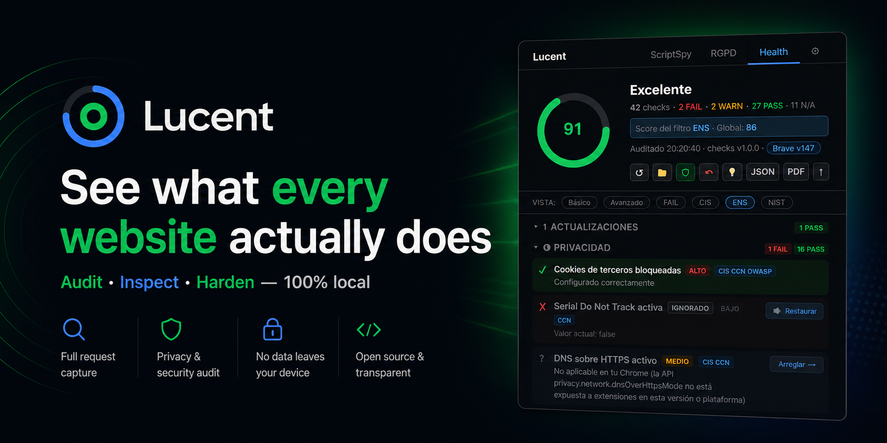
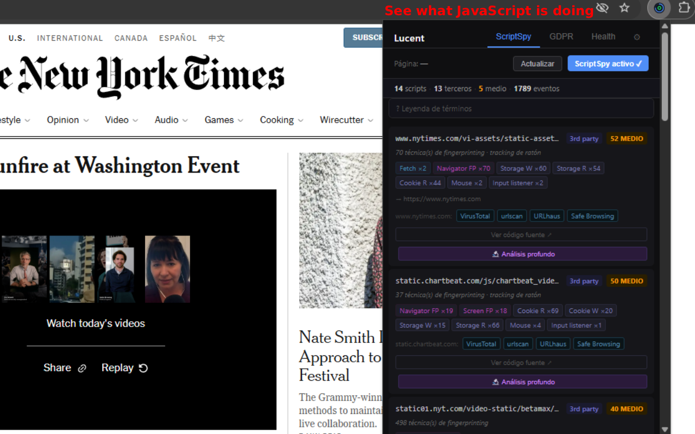
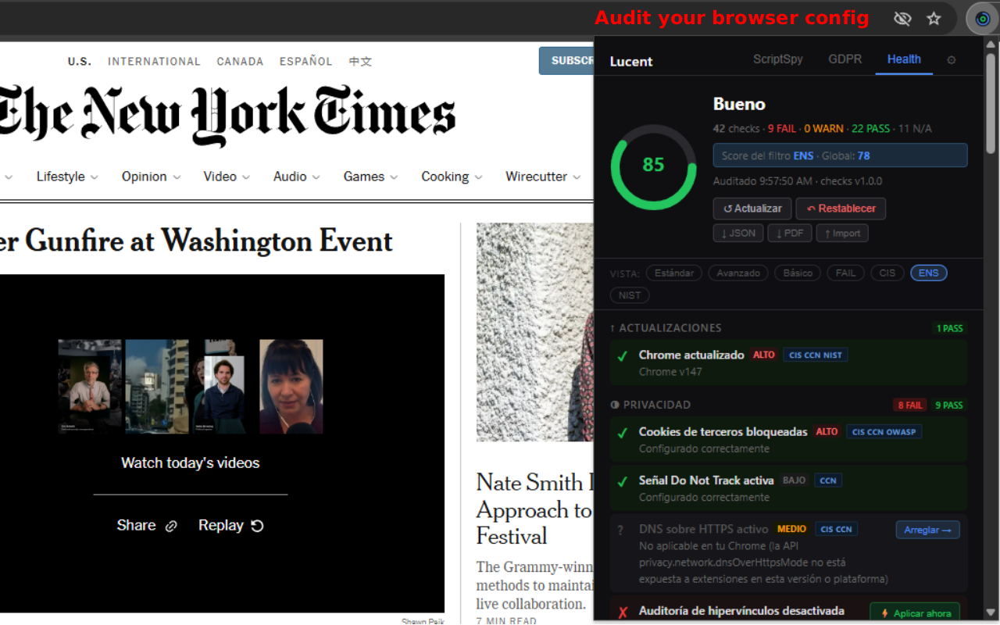
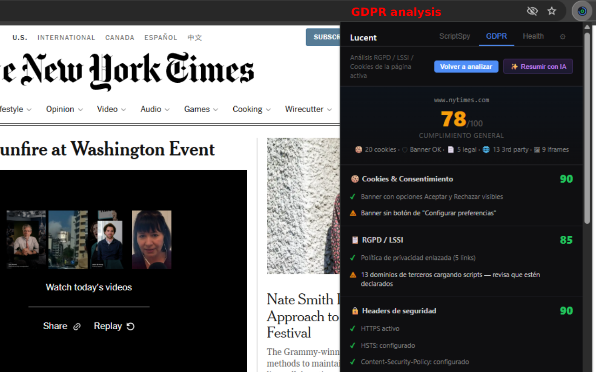
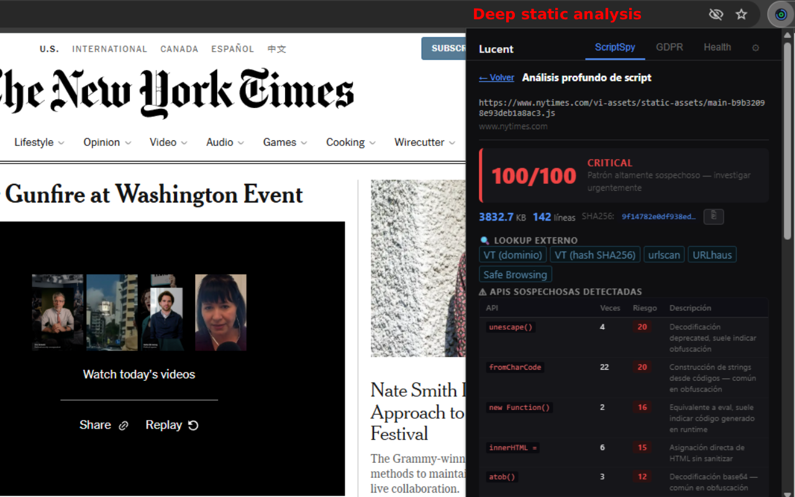

<div align="center">

<!-- Once docs/banner.png exists, uncomment the line below:

-->

# Lucent — Browser Audit

**Audit your browser's security, inspect JavaScript on any website, and analyze GDPR compliance — all local, all free.**

[](LICENSE)
[](#)
[](docs/STATUS.md)
[](#)

[Install](#install) · [Features](#features) · [Privacy](#privacy) · [Roadmap](#roadmap) · [Documentation](docs/)

</div>

---

## What is Lucent?

Lucent is a browser extension that audits your security configuration, inspects what JavaScript actually does on any website, and analyzes GDPR/cookie compliance — entirely on your device. No accounts, no telemetry, no servers.

Three tools in one popup:

| Module | What it does |
|---|---|
| 🔬 **ScriptSpy** | Real-time inspection of every script: network calls, fingerprinting, cookie reads, input tracking. Per-script risk score + deep static analysis (SHA256, obfuscation, suspicious APIs). When the source is blocked, a runtime fallback shows timing, SRI, and observed behavior. |
| 📋 **GDPR audit** | Page-level compliance check: consent banners, privacy-policy links, security headers, mixed content, CSP, library versions, CSRF detection. |
| 🛡 **Health Check** | 40+ checks against CIS Benchmark, NIST SP 800-53, and CCN-STIC-885 (Spanish ENS). One-click apply per check, master ON/OFF toggle for the whole hardening. |

Adapts tips per browser: Brave gets Shields-aware advice, Edge gets Tracking Prevention pointers, Vivaldi/Opera get their own paths. Bilingual UI (Spanish + English).

## Screenshots

<table>
<tr>
<td></td>
<td></td>
</tr>
<tr>
<td align="center"><sub><b>ScriptSpy</b> — risk-scored scripts in real time</sub></td>
<td align="center"><sub><b>Health Check</b> — 40+ checks with one-click apply</sub></td>
</tr>
<tr>
<td></td>
<td></td>
</tr>
<tr>
<td align="center"><sub><b>GDPR audit</b> — cookies, headers, banners, libraries</sub></td>
<td align="center"><sub><b>Deep analysis</b> — SHA256, obfuscation, suspicious APIs</sub></td>
</tr>
</table>

## Install

### From Chrome Web Store

Pending Google review. Once published, the link will land here.

### Manual (developer mode)

```bash
git clone https://github.com/wilasky/browser-audit.git
cd browser-audit
npm install
npm run build
```

Then in `chrome://extensions/`:
1. Enable **Developer mode** (top right)
2. Click **Load unpacked**
3. Select `extension/dist/`

Works the same in `brave://extensions/`, `edge://extensions/`, `opera://extensions/`, `vivaldi://extensions/`.

## Privacy

Lucent is built local-first.

- **100% local by default** — no telemetry, no analytics, no accounts.
- **No browsing data leaves your device** — URLs, cookies, page content, form values, history: never transmitted.
- **Optional AI** uses *your own* API key (Claude / OpenAI / Ollama). Content goes directly to your chosen provider, never through our servers.
- **Optional Pro tier** (when available) only sends SHA256 hashes for threat-intelligence lookups, never URLs.

Full text in [docs/PRIVACY_POLICY.md](docs/PRIVACY_POLICY.md).

## Roadmap

The extension client (this repo) is **MIT** and stays free forever.

A future **Lucent Pro** (€2/mo) will add:

- Real-time threat intelligence (URLhaus, MalwareBazaar, OpenPhish)
- Bundled AI proxy — no API key needed
- Persistent per-setting locks (Lucent restores the value if anything else tries to change it)
- Per-check undo

See [docs/PRO_ROADMAP.md](docs/PRO_ROADMAP.md) for the full picture and [docs/PRO_V1_PLAN.md](docs/PRO_V1_PLAN.md) for the realistic 8-week plan.

## Architecture

- **Manifest V3** strict — no remotely-hosted code, no eval, minimal permissions.
- **Vanilla JavaScript** + esbuild bundler — no framework runtime in the popup.
- **Vitest** unit tests, **Puppeteer** end-to-end.
- Optional permissions (`management`, `privacy`, `contentSettings`, host permissions) requested only when needed.

See [docs/ARCHITECTURE.md](docs/ARCHITECTURE.md) for the full layout.

## Status & contributing

Current state: [docs/STATUS.md](docs/STATUS.md). Pending tasks: [docs/PENDING_TASKS.md](docs/PENDING_TASKS.md).

Bug reports and feature requests via [GitHub issues](https://github.com/wilasky/browser-audit/issues). PRs welcome on the extension client.

## License

[MIT](LICENSE) for the extension client. The future Pro threat-intelligence backend and curated YARA rules are proprietary.

---

<div align="center">
<sub>Built by <a href="https://github.com/wilasky">@wilasky</a>. Not affiliated with Google or any browser vendor.</sub>
</div>
